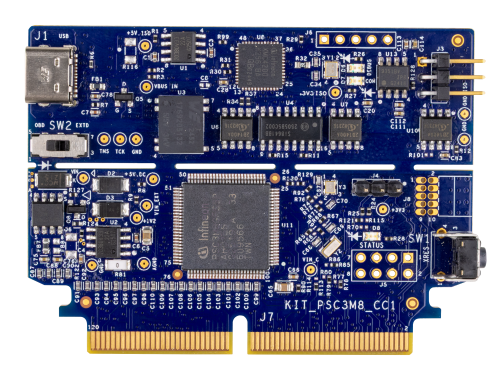

# KIT_PSC3M8_CC1 BSP

## Overview

The PSOC™ Control C3M8 Digital Power Control Card (KIT_PSC3M8_CC1) is based on the Infineon PSOC™ Control C3M8 microcontroller and features an onboard debugger along with a 120-pin edge connector for seamless integration with compatible power boards. Powered by an Arm® Cortex®-M33 based PSOC™ Control MCU, the card is designed to evaluate, develop, and demonstrate advanced digital power control applications. When paired with supported power boards, it showcases the capabilities of the PSOC™ Control C3M8 device for power conversion, motor control, and other real-time power stage control applications. The card plugs into a standard 120-pin edge connector, providing a flexible platform for rapid prototyping, system evaluation, and application development using the PSOC™ Control C3M8 MCU.

**Note:** Programming this kit requires installing [SEGGER J-Link software](https://www.segger.com/downloads/jlink/#J-LinkSoftwareAndDocumentationPack).

To use code from the BSP, simply include a reference to `cybsp.h`.

## Features

Kit Features:

- PSOC™ Control C3M8 (Arm® Cortex®-M33 based) Microcontroller
- 120-pin edge connector exposing all PSOC™ Control C3M8 IOs
- On-board XMC4200 debug probe (J-Link) with isolated USB Type-C interface supporting SWD
- Isolated UART virtual COM port and isolated CAN FD transceiver interface
- Isolated 5 V power supply with 5 V-to-3.3 V LDOs
- One status LED, a reset button, and an I2C header

Kit Contents:

- PSOC™ Control C3P8 Digital Power Control Card
- PSOC™ Control C3P8 Interface Board
- Type C to USB A cable

## BSP Configuration

The BSP has a few hooks that allow its behavior to be configured. Some of these items are enabled by default while others must be explicitly enabled. Items enabled by default are specified in the KIT_PSC3M8_CC1.mk file. The items that are enabled can be changed by creating a custom BSP or by editing the application makefile.

### Clock Configuration

|  Clock  |   Source  | Output Frequency |
| :-----: | :-------: | :--------------: |
|   FLL   |    IHO    |    100.0 MHz     |
| CLK_HF0 | CLK_PATH1 |     180 MHz      |
| CLK_HF1 | CLK_PATH1 |     180 MHz      |
| CLK_HF2 | CLK_PATH1 |     180 MHz      |
| CLK_HF3 | CLK_PATH2 |     200 MHz      |
| CLK_HF4 | CLK_PATH2 |     200 MHz      |

### Power Configuration

* System Active Power Mode: OD
* System Idle Power Mode: Deep Sleep
* VDDA Voltage: 3300 mV
* VDDD Voltage: 3300 mV

See the [BSP Setttings][settings] for additional board specific configuration settings.

## API Reference Manual

The KIT_PSC3M8_CC1 Board Support Package provides a set of APIs to configure, initialize and use the board resources.

See the [BSP API Reference Manual][api] for the complete list of the provided interfaces.

## More information
* [KIT_PSC3M8_CC1 BSP API Reference Manual][api]
* [KIT_PSC3M8_CC1 Documentation](https://www.infineon.com/evaluation-board/KIT-PSC3M8-CC1)
* [Infineon Technologies AG](https://www.infineon.com)
* [Infineon GitHub](https://github.com/infineon)
* [ModusToolbox™](https://www.infineon.com/modustoolbox)

[api]: https://infineon.github.io/TARGET_KIT_PSC3M8_CC1/html/modules.html
[settings]: https://infineon.github.io/TARGET_KIT_PSC3M8_CC1/html/md_bsp_settings.html

---
© 2026, Infineon Technologies AG, or an affiliate of Infineon Technologies AG.